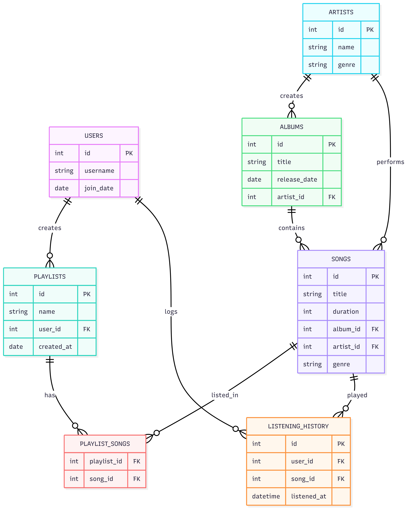

# Music Manager Database

By **Pavan Sathvik**

Video overview: https://youtu.be/TgzArJl7ZGE

---

## Scope

The purpose of this database is to simulate a simplified music streaming backend system where users can create playlists, explore music by different artists and albums, and track their listening history.

The database is designed to handle:

- Users and their personal data
- Songs, albums, and artists
- Playlists created by users
- Listening history (logs of user activity)

**Included in scope:**

- Storage of music metadata (songs, albums, genres, etc.)
- Managing playlists and their contents
- Logging when users listen to songs

**Excluded from scope:**

- Audio file storage or streaming
- Payments/subscriptions
- Social media interactions
- Music recommendations or AI-based suggestions

---

## Functional Requirements

**Users should be able to:**

- Register and create an account
- Add songs and albums to playlists
- View their listening history
- Query their most played songs or artists
- Search for songs by artist or title

**Beyond scope:**

- Listening to music (streaming functionality)
- Rating or liking songs
- Following other users or sharing playlists
- Advanced music discovery or recommendation features

---

## Representation

### Entities

The main entities in the database are:

#### Users

- `id`: Unique identifier (INTEGER, PRIMARY KEY)
- `username`: Name of the user (TEXT, NOT NULL)
- `join_date`: Account creation date (DATE, NOT NULL)

#### Artists

- `id`: Unique identifier (INTEGER, PRIMARY KEY)
- `name`: Name of the artist (TEXT, NOT NULL)
- `genre`: Music genre (TEXT)

#### Albums

- `id`: Unique identifier (INTEGER, PRIMARY KEY)
- `title`: Album name (TEXT, NOT NULL)
- `release_date`: Date the album was released (DATE)
- `artist_id`: Reference to artist (INTEGER, FOREIGN KEY)

#### Songs

- `id`: Unique identifier (INTEGER, PRIMARY KEY)
- `title`: Song name (TEXT, NOT NULL)
- `duration`: Duration in seconds (INTEGER)
- `album_id`: Reference to album (INTEGER, FOREIGN KEY)
- `artist_id`: Reference to artist (INTEGER, FOREIGN KEY)
- `genre`: Music genre (TEXT)

#### Playlists

- `id`: Unique identifier (INTEGER, PRIMARY KEY)
- `name`: Playlist name (TEXT, NOT NULL)
- `user_id`: Owner of the playlist (INTEGER, FOREIGN KEY)
- `created_at`: Creation date (DATE, NOT NULL)

#### PlaylistSongs (Join table)

- `playlist_id`: Playlist ID (INTEGER, FOREIGN KEY)
- `song_id`: Song ID (INTEGER, FOREIGN KEY)

#### ListeningHistory

- `id`: Unique identifier (INTEGER, PRIMARY KEY)
- `user_id`: Who listened (INTEGER, FOREIGN KEY)
- `song_id`: What was listened to (INTEGER, FOREIGN KEY)
- `listened_at`: Timestamp of listening (DATETIME, DEFAULT CURRENT_TIMESTAMP)

### Data Types and Constraints

- All primary keys are of type `INTEGER` for performance.
- `TEXT` is used for flexible-length fields like names and genres.
- Foreign key constraints ensure data integrity between tables.
- Dates and times use `DATE` and `DATETIME` respectively.

---

## Relationships

### Entity Relationship Diagram

### Relationship Summary

- One artist can have multiple albums and songs.
- Each album is created by one artist and contains many songs.
- One user can create multiple playlists.
- One playlist can contain multiple songs, and each song can be in many playlists (many-to-many).
- Each user can listen to multiple songs, and each song can be listened to by many users.

---

## Optimizations

- **Indexes** are created on foreign keys (`user_id`, `song_id`, `playlist_id`) to improve performance of JOIN operations.
- Index on `song_title` to allow faster searching by title.
- The schema is normalized to **3NF** to minimize redundancy and maintain consistency.

---

## Limitations

- No support for songs performed by multiple artists (collaborations).
- No functionality for social features like following users or liking songs.
- Genre is stored as plain text and not standardized via a separate `genres` table.
- No advanced recommendation algorithms or machine learning logic.

---
